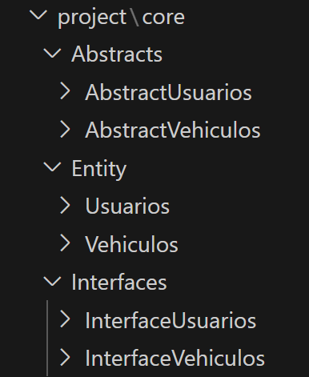

# AutoCode
Genera el código básico para programación orienta a objetos en Python de forma automática, acelerando procesos de rutina uniformes en todo desarrollo, como el diseño de interfaces, clases abstraptas y entidades de acuerdo al proyecto que se vaya a realizar. Salvo los necesarios ajustes que se deban realizar de acuerdo al modelo de negocio.

### DEMO ('main.py')
```Python
from AutoCode.AutoCode import AutoCode

autoCode = AutoCode()

usuario = [
'id_usuario','nombre', 'apellido', 'celular', 'direccion'
]
autoCode.generate("usuarios", usuario)

vehiculo = [
    'id_vehiculo','matricula', 'estado', 'usuario_id'
]
autoCode.generate("vehiculos", vehiculo)

```

### Esto va a generar una carpeta con el nombre 'project'.



### Ejemplo de código generado:

Interface para la entidad Usuarios:
```Python
# Interface para la entidad Usuarios:

from abc import ABCMeta, abstractmethod

class InterfaceUsuarios(metaclass=ABCMeta):

    id_usuario = str()
    nombre = str()
    apellido = str()
    celular = str()
    direccion = str()

    @abstractmethod
    def __init__(self, id_usuario:str='', nombre:str='', apellido:str='', celular:str='', direccion:str=''):
        pass
    
    @abstractmethod
    def set_id_usuario(self, id_usuario:str):
        pass

    @abstractmethod
    def get_id_usuario(self)->str:
        pass
    
    @abstractmethod
    def set_nombre(self, nombre:str):
        pass

    @abstractmethod
    def get_nombre(self)->str:
        pass
    
    @abstractmethod
    def set_apellido(self, apellido:str):
        pass

    @abstractmethod
    def get_apellido(self)->str:
        pass
    
    @abstractmethod
    def set_celular(self, celular:str):
        pass

    @abstractmethod
    def get_celular(self)->str:
        pass
    
    @abstractmethod
    def set_direccion(self, direccion:str):
        pass

    @abstractmethod
    def get_direccion(self)->str:
        pass
```
Clase abstrapta para la entidad Usuarios:
```Python
# Clase abstrapta para la entidad Usuarios:
from abc import abstractmethod
from core.Interfaces.InterfaceUsuarios.InterfaceUsuarios import InterfaceUsuarios

class AbstractUsuarios(InterfaceUsuarios):

    id_usuario = str()
    nombre = str()
    apellido = str()
    celular = str()
    direccion = str()
    
    @abstractmethod
    def __init__(self, id_usuario:str='', nombre:str='', apellido:str='', celular:str='', direccion:str=''):
        pass
    
    @abstractmethod
    def set_id_usuario(self, id_usuario:str):
        pass

    @abstractmethod
    def get_id_usuario(self)->str:
        pass
    
    @abstractmethod
    def set_nombre(self, nombre:str):
        pass

    @abstractmethod
    def get_nombre(self)->str:
        pass
    
    @abstractmethod
    def set_apellido(self, apellido:str):
        pass

    @abstractmethod
    def get_apellido(self)->str:
        pass
    
    @abstractmethod
    def set_celular(self, celular:str):
        pass

    @abstractmethod
    def get_celular(self)->str:
        pass
    
    @abstractmethod
    def set_direccion(self, direccion:str):
        pass

    @abstractmethod
    def get_direccion(self)->str:
        pass
```

Entidad Usuarios:
```Python
# Entidad Usuarios:
from core.Abstracts.AbstractUsuarios.AbstractUsuarios import AbstractUsuarios

class Usuarios(AbstractUsuarios):

    id_usuario = str()
    nombre = str()
    apellido = str()
    celular = str()
    direccion = str()

    def __init__(self, id_usuario:str='', nombre:str='', apellido:str='', celular:str='', direccion:str=''):
        self.id_usuario = id_usuario
        self.nombre = nombre
        self.apellido = apellido
        self.celular = celular
        self.direccion = direccion
    
    def set_id_usuario(self, id_usuario:str):
        self.id_usuario = id_usuario

    def get_id_usuario(self)->str:
        return self.id_usuario
    
    def set_nombre(self, nombre:str):
        self.nombre = nombre

    def get_nombre(self)->str:
        return self.nombre
    
    def set_apellido(self, apellido:str):
        self.apellido = apellido

    def get_apellido(self)->str:
        return self.apellido
    
    def set_celular(self, celular:str):
        self.celular = celular

    def get_celular(self)->str:
        return self.celular
    
    def set_direccion(self, direccion:str):
        self.direccion = direccion

    def get_direccion(self)->str:
        return self.direccion

```
## Documentación técnica

### Configuración del entorno de desarrollo.
No se requiere configuraciones especiales, es Python Puro.

### Librerías del proyecto.
No requiere ninguna librería a instalar.


### Modo de uso
Ajuste el main.py a su gusto y por consola digite:  

```CMD

py main.py

```
---
